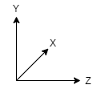

# Simple-Flight
An Old Flight Simulator Project From Highschool

# A note about the coordinate system and maths used.
The coordinate space has the X-axis facing forward, the Y-axis facing upwards and the Z-axis facing to the right, as illustrated below. The screen is drawn along the plane where `x = 1.0` from the perspective of the camera.

Orientations are a set of three Euler angles. When applied to a vector, the vector is first rotated about the X-axis by the angle `alpha`, then about the Y-axis by the angle `beta` and lastly about the Z-axis by the angle `gamma`.

Applying an orientation to a vector has the effect of applying a perspective shift. Take for instance the `j` vector `{x = 0.0, y = 1.0, z = 0.0}`. If you apply the perspective of a camera lying on its right side, i.e `{alpha = pi/2, beta = 0.0, gamma = 0.0}`, you'll get the `k` vector `{x = 0.0, y = 0.0, z = 1.0}`. This is because the the camera sees an `i` vector when the rest of the world sees a `k` vector, because of the perspective shift of lying on your right side.